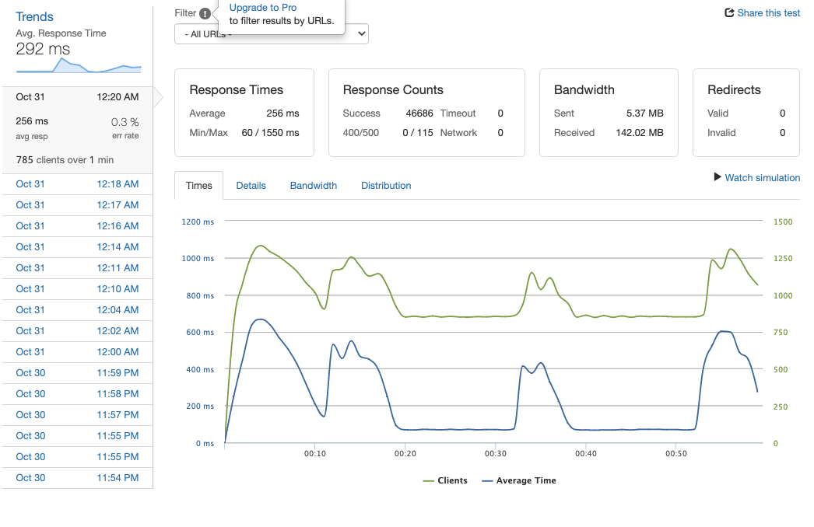
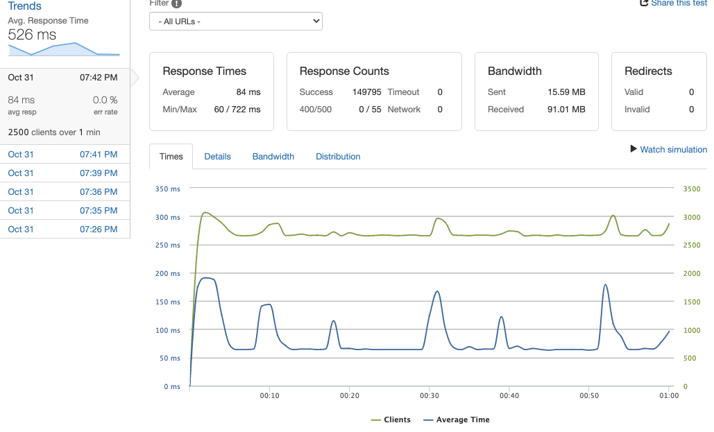
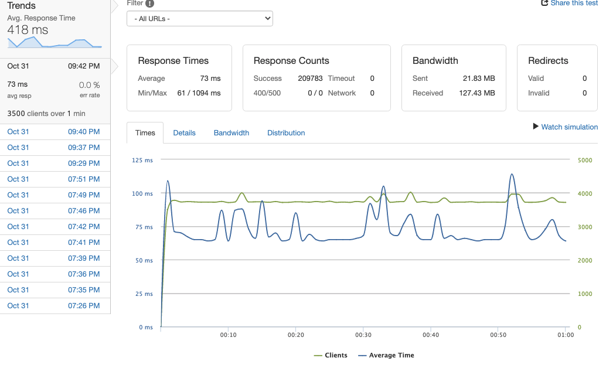
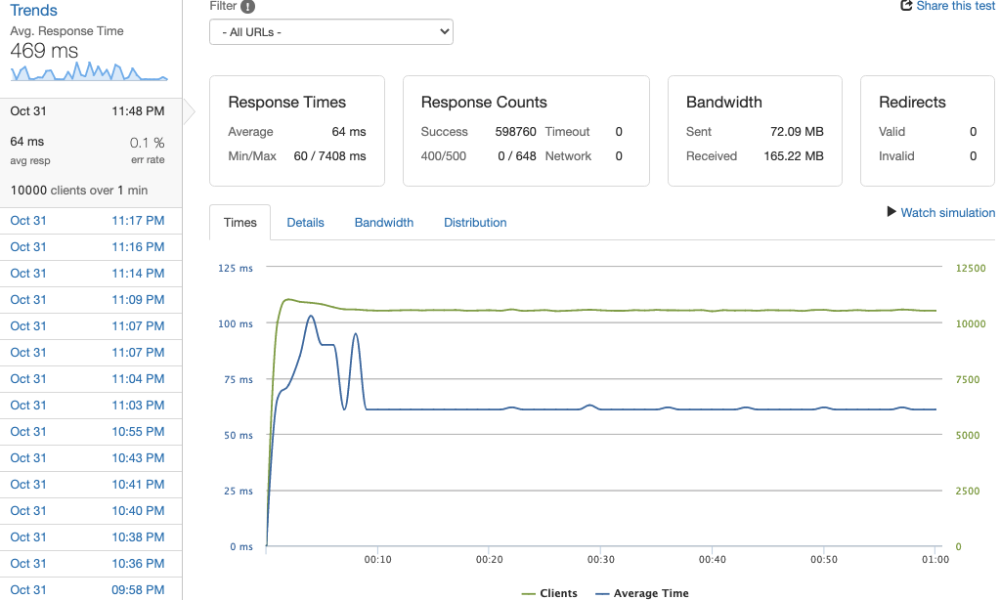

# Etsy - Related Products Module
This is an application that was inherited from gEtsy's legacy codebase. The goal of this project was to build a scalable RESTful API service for a retail website and optimize to handle web-scale traffic. The database is scaled to 10 million data points and the server layer is extended to support production-level traffic while maintaining its service-oriented architecture. The service was incrementally optimized through database multicolumn-indexing, horizontal scaling, and Nginx caching to handle a throughput of 10k client requests per second with an average response time of 60ms.

---


---

Related Products and Searches Repo
## Table of Contents
* [Installation Guide](#installation-guide)
* [Tech Stack](#tech-stack)
* [Database Schema](#database-schema)
* [Routes API](#routes-api)
* [Optimization](#optimization)

---

## Installation Guide

### Navigate to the root directory and run the following in your terminal:

>*Install dependencies*
```
npm install
```
>*Generate 10 million mock product data in CSV*
```
npm run seed
```
>*Import CSV to PostgreSQL database*
```
npm run postgres:import
```
>*Start the server*
```
npm start
```
Open `http://localhost:8005`

---

## Tech Stack
- ExpressJS
- MongoDB
- PostgreSQL

---

## Database Schema

### Product Table
- name
- imgurl
- shop
- price
- sale
- freeShipping
- ad
- categoryId
- clicks

### Search Table
- name
- imgurl
- isSearch
- categoryId
- clicks

### Subsrcibe Table
- email

---

## Routes API
Routes | HTTP | Description | Status
--- | --- | --- | ---
**/related/ads/:id** | `GET` | Returns a list of advertised products for a particular product | 200
**/related/items/:id** | `GET` | Returns a list of related products for a particular product | 200
**/related/searches/:id** | `GET` | Returns a list of search words for a particular product | 200
**/related/categories/:id** | `GET` | Returns a list of words for a category | 200
**/related/subscribe/:email** | `GET` | Returns an email for a user | 200
**/related/subscribe/** | `POST` | Creates a subscription email | 201

---

## Optimization

### Query
>GET -- /related/ads/%{*:1-100000}

>PostgreSQL command:
```
SELECT * FROM products
WHERE categoryId = `${id}`
ORDER BY clicks ASC
LIMIT 12;
```

### Query Benchmarking Before AWS Server Deployment
Optimization Type | Avg. Response Time
--- | ---
No Indexing | 8050 ms
Multicolumn Indexing (categoryid ASC, clicks DESC) | 13 ms

### Load-Testing in AWS EC2 Instance
Optimization Type | Responses / Second* | Response Time** |  Error Rate
--- | --- | --- | ---
Indexing | 850 rps | 60 ms | 0.3 %
Indexing, Horizontal Scaling (2 servers)*** | 2100 rps | 61 ms | 0.0 %
Indexing, Horizontal Scaling (3 servers) | 2650 rps | 60 ms | 0.0 %
Indexing, Horizontal Scaling (4 servers) | 3500 rps | 65 ms | 0.0 %
Indexing, Horizontal Scaling (4 servers), Nginx Caching | 10500 rps | 60 ms | 0.1 %

**Number of responses per second at bottleneck (Error Rate < 1.0%)*

***Response time at stable state*

****Horizontal scaling was performed using Nginx Round-Robin load balancing*

### Detailed Loader.io results:

<details>
<summary>Indexing</summary>
<br>



</details>

<details>
<summary>Indexing, Horizontal Scaling (2 servers)</summary>
<br>


</details>

<details>
<summary>Indexing, Horizontal Scaling (3 servers)</summary>

<br>



</details>

<details>
<summary>Indexing, Horizontal Scaling (4 servers)</summary>

<br>



</details>

<details>
<summary>Indexing, Horizontal Scaling (4 servers), Nginx Caching</summary>

<br>



</details>
